# Briefly Web Dashboard User Guide

이 문서는 실제 로컬 스택을 실행한 뒤 Playwright로 캡처한 화면을 기준으로 작성한 사용자 가이드입니다.

- 캡처일: 2026-04-29
- API 서버: `http://127.0.0.1:8000`
- Web dashboard: `http://127.0.0.1:3001`
- Mail catcher: `http://127.0.0.1:8025`
- LLM 전용 llama-server endpoint: `http://127.0.0.1:8080/v1/chat/completions`

## 검증 메모

이번 검증에서 Briefly API는 `SUMMARY_PROVIDER=openai`, `SUMMARY_BASE_URL=http://127.0.0.1:8080/v1/chat/completions`, `SUMMARY_MODEL=local-model` 설정으로 llama-server에 요약 요청을 보냈고, llama-server 응답도 API 로그에서 확인했습니다.

단, 현재 `/api/v1/share`의 background 요약 저장 단계는 SQLite 사용 시 `database is locked`로 실패할 수 있습니다. 즉, LLM 호출 자체는 성공했지만 요약 결과가 DB에 저장되지 않는 경우가 있습니다. 이 가이드의 요약이 표시된 샘플 카드는 실제 llama-server 응답 문구를 검증용 DB에 반영해 캡처했습니다.

## 시작 전 알아둘 서버 구분

같은 `127.0.0.1` 주소라도 포트가 다르면 서로 다른 서버입니다.

| 용도 | 주소 | 설명 |
|---|---:|---|
| Web dashboard | `http://127.0.0.1:3001` | 사용자가 보는 화면 |
| Briefly API | `http://127.0.0.1:8000` | 로그인, 콘텐츠, swipe, 설정 API |
| Mail catcher | `http://127.0.0.1:8025` | 개발용 인증 메일 확인 화면 |
| Local LLM | `http://127.0.0.1:8080/v1/chat/completions` | 제목/요약 생성을 위한 llama-server OpenAI 호환 endpoint |

## 1. 로그인 화면

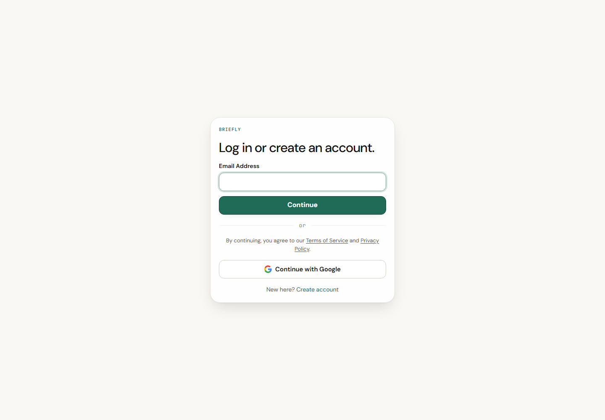

이 화면은 이미 만든 계정으로 dashboard에 들어가는 입구입니다.

- `Email Address`: 로그인할 이메일을 입력합니다.
- `Continue`: 이메일 입력 후 비밀번호 단계로 넘어갑니다.
- `Continue with Google`: Google OAuth 로그인을 시작합니다. 로컬 개발에서는 `GOOGLE_CLIENT_ID`가 실제 Google OAuth client로 설정되어 있어야 합니다.
- `Create account`: 새 계정 생성 화면으로 이동합니다.
- `Terms of Service`, `Privacy Policy`: 현재 라우팅 링크만 있으며 실제 약관 페이지가 없으면 dashboard로 리다이렉트될 수 있습니다.

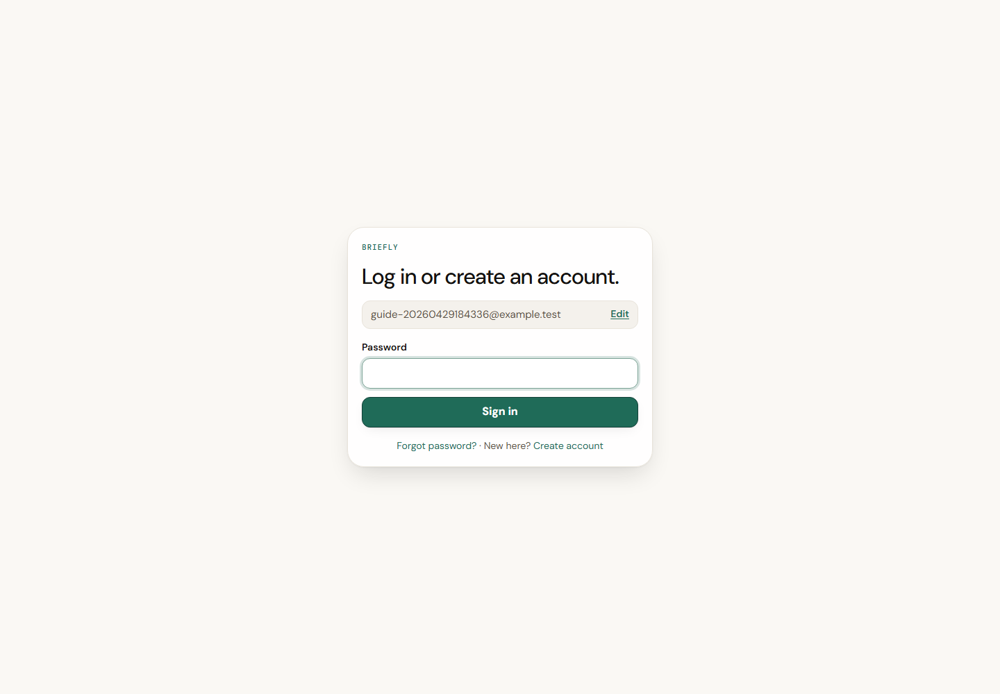

비밀번호 단계입니다.

- `Edit`: 이메일을 잘못 입력했을 때 이전 단계로 돌아갑니다.
- `Password`: 계정 비밀번호를 입력합니다.
- `Sign in`: Briefly API의 `/api/v1/auth/login`으로 로그인 요청을 보냅니다.
- `Forgot password?`: 비밀번호 재설정 요청 화면으로 이동합니다.
- 이메일 인증이 끝나지 않은 계정이면 `Resend verification email` 버튼이 표시될 수 있습니다.

## 2. 계정 만들기

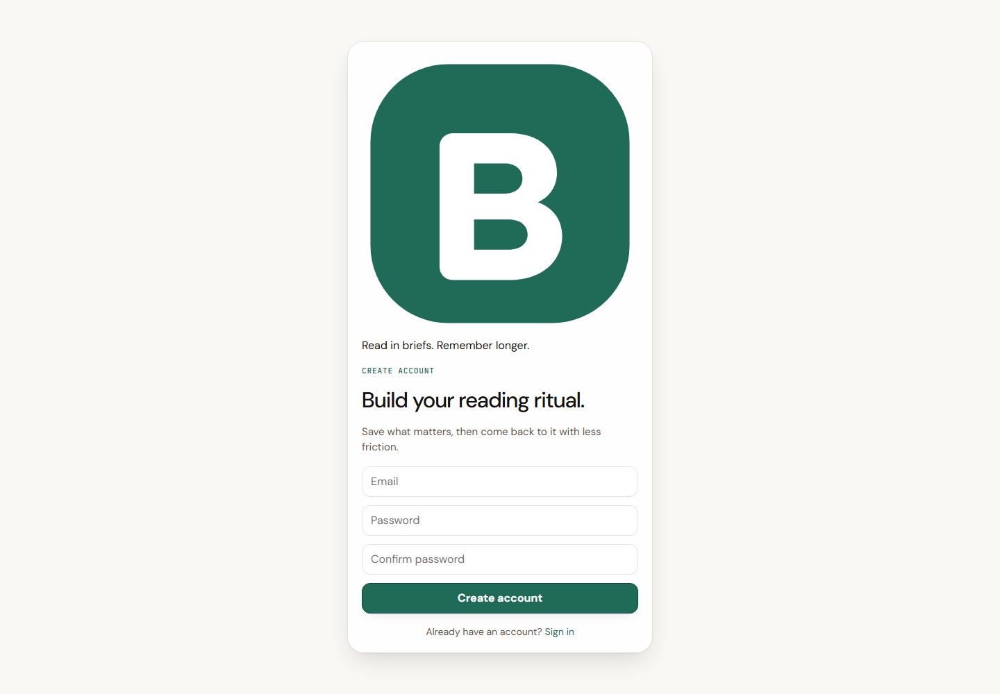

새 계정을 만드는 화면입니다.

- `Email`: 사용할 이메일 주소입니다.
- `Password`: 8자 이상 비밀번호입니다.
- `Confirm password`: 같은 비밀번호를 한 번 더 입력합니다.
- `Create account`: `/api/v1/auth/register`로 계정 생성 요청을 보냅니다.
- 계정 생성 후에는 "Check your inbox" 안내가 표시되고, 개발 환경에서는 Mail catcher에서 인증 메일을 확인합니다.
- `Sign in`: 이미 계정이 있으면 로그인 화면으로 돌아갑니다.

## 3. 개발용 메일 확인

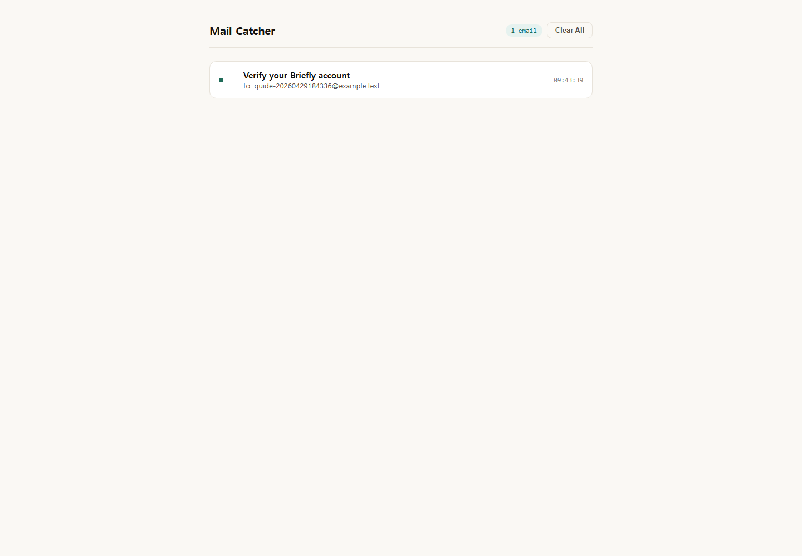

Mail catcher는 실제 이메일 서비스 대신 로컬에서 인증/재설정 메일을 모아 보여주는 개발용 도구입니다.

- `Verify your Briefly account`: 방금 가입한 계정의 인증 메일입니다. 클릭하면 상세 화면으로 들어갑니다.
- `Clear All`: 받은 메일 목록을 비웁니다. 테스트 중 메일이 많아지면 이 버튼으로 정리합니다.

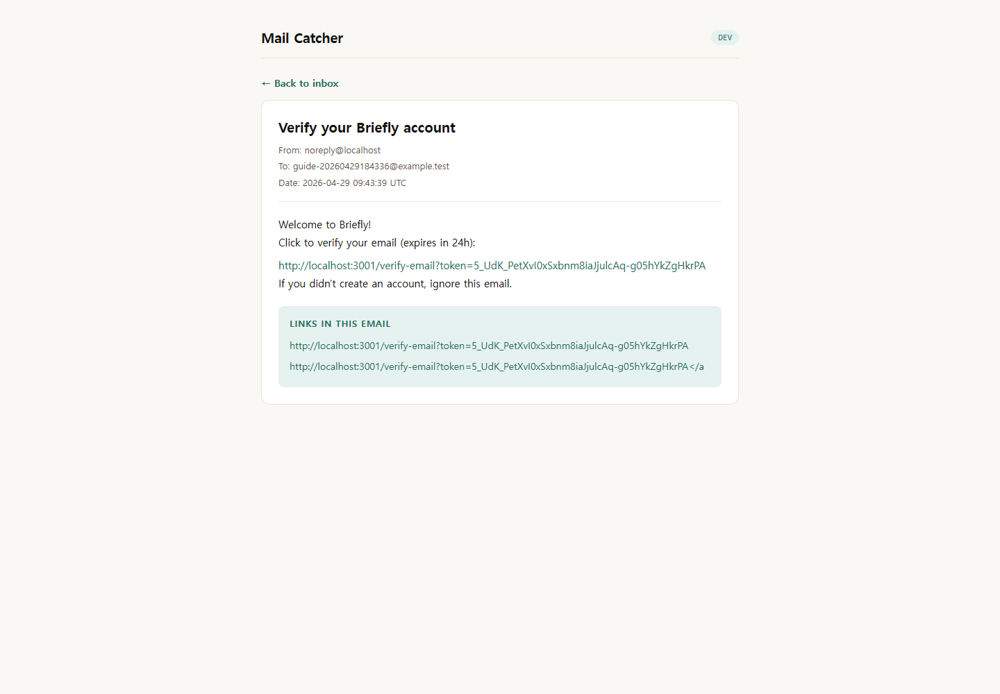

메일 상세 화면입니다.

- 본문 안의 인증 링크를 클릭하면 dashboard의 `/verify-email?token=...` 화면으로 이동합니다.
- `Links in this email` 영역은 메일 안에서 추출된 링크만 따로 보여줍니다. 링크가 길거나 본문에서 찾기 어렵다면 이 영역을 사용합니다.
- `Back to inbox`: 메일 목록으로 돌아갑니다.

## 4. Dashboard

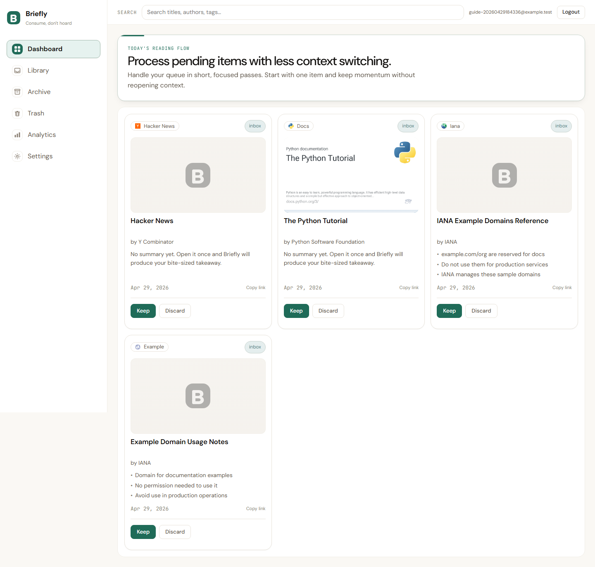

Dashboard는 아직 처리하지 않은 inbox 콘텐츠를 빠르게 훑고 정리하는 화면입니다. 카드 형태로 콘텐츠가 보이고, 각 카드에서 바로 보관하거나 버릴 수 있습니다.

왼쪽 navigation:

- `Dashboard`: 처리 대기 중인 콘텐츠 카드 화면입니다.
- `Library`: 전체 저장 콘텐츠를 표로 봅니다.
- `Archive`: 보관한 콘텐츠를 봅니다.
- `Trash`: 삭제한 콘텐츠를 복구하거나 완전 삭제합니다.
- `Analytics`: 저장/처리 통계를 봅니다.
- `Settings`: 보기 방식, 페이지 크기, API base URL을 설정합니다.

상단 bar:

- `Search titles, authors, tags...`: 제목, 작성자, 태그 기준으로 검색합니다.
- 사용자 이메일: 현재 로그인한 계정입니다.
- `Logout`: 로컬 토큰을 지우고 로그인 화면으로 돌아갑니다.

카드 안 버튼:

- `Keep`: 콘텐츠를 읽었거나 남겨둘 가치가 있다고 판단해 Archive로 보냅니다. 내부적으로 `/api/v1/swipe`에 `action=keep`을 보냅니다.
- `Discard`: 콘텐츠를 Trash로 보냅니다. 복구 가능 기간 안에는 Trash에서 되돌릴 수 있습니다.
- `Copy link`: 원본 URL을 클립보드에 복사합니다.
- 카드의 요약 영역: LLM 요약이 저장된 경우 짧은 bullet summary가 표시됩니다. 없으면 "No summary yet" 안내가 보입니다.

## 5. Library

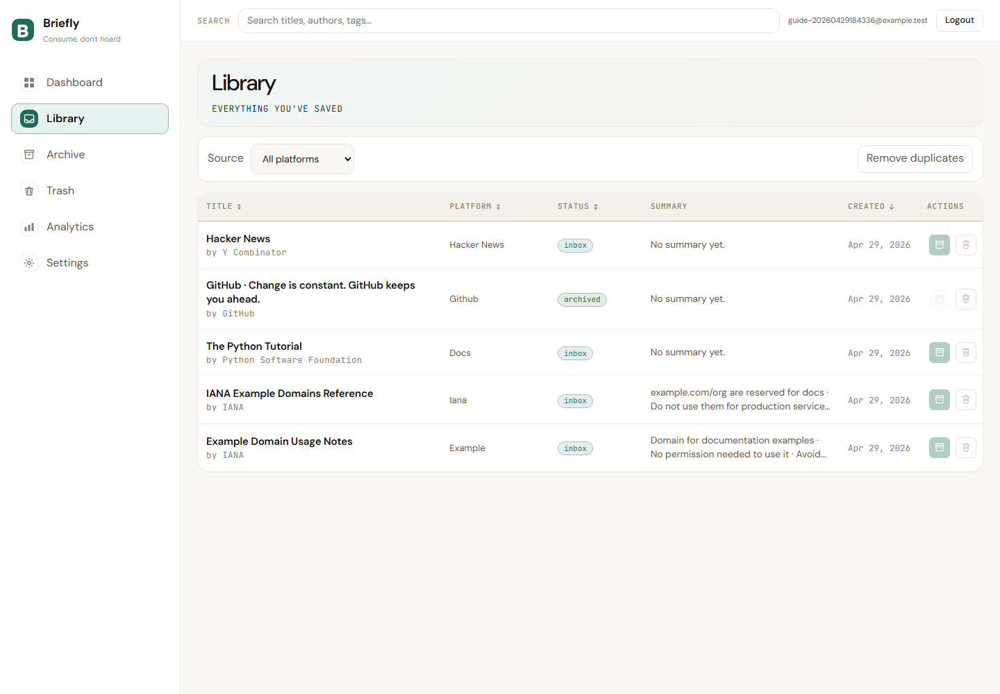

Library는 저장된 모든 콘텐츠를 표로 관리하는 화면입니다. inbox와 archived 상태가 함께 보입니다.

- `Source`: 플랫폼별로 목록을 좁힙니다. 예: `Iana`, `Docs`, `Github`, `Youtube`.
- `Remove duplicates`: 같은 URL 또는 중복 그룹으로 판단되는 항목을 정리합니다.
- `Title`: 제목과 작성자를 보여줍니다. 제목을 클릭하면 상세 drawer가 열립니다.
- `Platform`: 콘텐츠 출처입니다.
- `Status`: `inbox` 또는 `archived` 상태입니다.
- `Summary`: 저장된 LLM 요약을 한 줄 형태로 줄여 보여줍니다.
- `Created`: 저장된 날짜입니다.
- `Actions`의 archive 아이콘: inbox 항목을 Archive로 보냅니다.
- `Actions`의 trash 아이콘: 항목을 Trash로 보냅니다.
- `Title`, `Platform`, `Status`, `Created` 헤더의 화살표: 해당 기준으로 정렬합니다.

## 6. 콘텐츠 상세 drawer

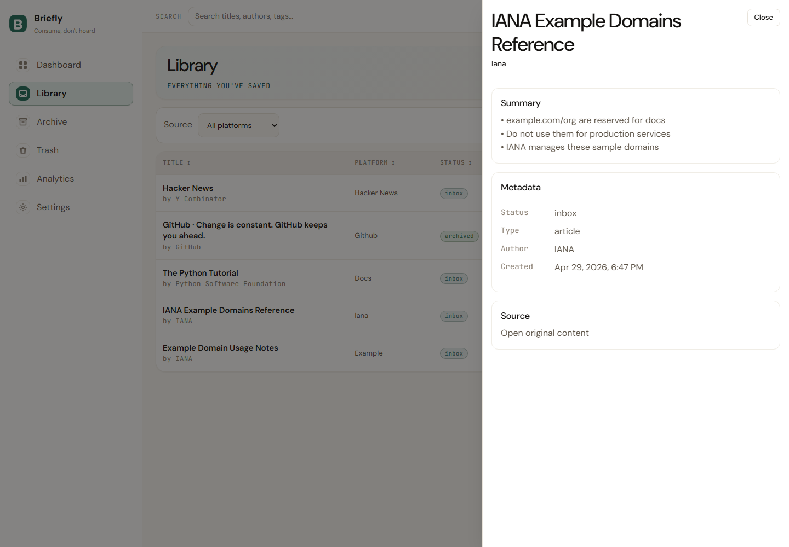

Library나 Archive에서 제목을 클릭하면 오른쪽 drawer가 열립니다.

- 상단 제목: 선택한 콘텐츠의 제목입니다.
- `Close`: drawer를 닫고 목록으로 돌아갑니다.
- `Summary`: LLM 요약 결과가 있으면 bullet 형태로 보여줍니다.
- `Metadata`: 상태, 콘텐츠 유형, 작성자, 생성 시각을 보여줍니다.
- `Open original content`: 원본 URL을 새 탭으로 엽니다.

이 drawer는 "이 링크가 무엇이었는지"를 빠르게 확인하는 용도입니다. 전체 글을 다시 열기 전에 요약과 메타데이터만 확인할 수 있습니다.

## 7. Archive

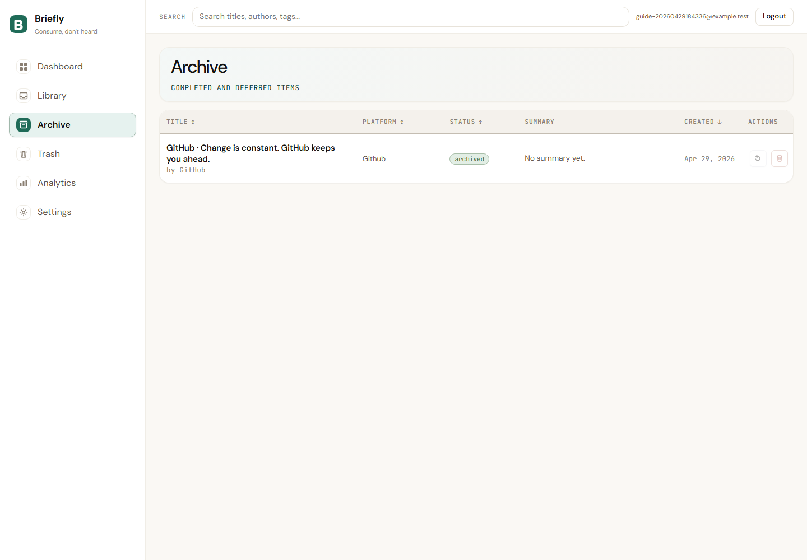

Archive는 `Keep`한 콘텐츠가 모이는 곳입니다.

- archived badge: 이미 보관된 항목이라는 뜻입니다.
- 되돌리기 아이콘: Archive에서 Library inbox로 복구합니다.
- trash 아이콘: Archive 항목을 Trash로 보냅니다.
- 제목 클릭: 상세 drawer를 엽니다.
- 정렬 헤더: Library와 같은 방식으로 제목, 플랫폼, 상태, 생성일 기준 정렬을 바꿉니다.

## 8. Trash

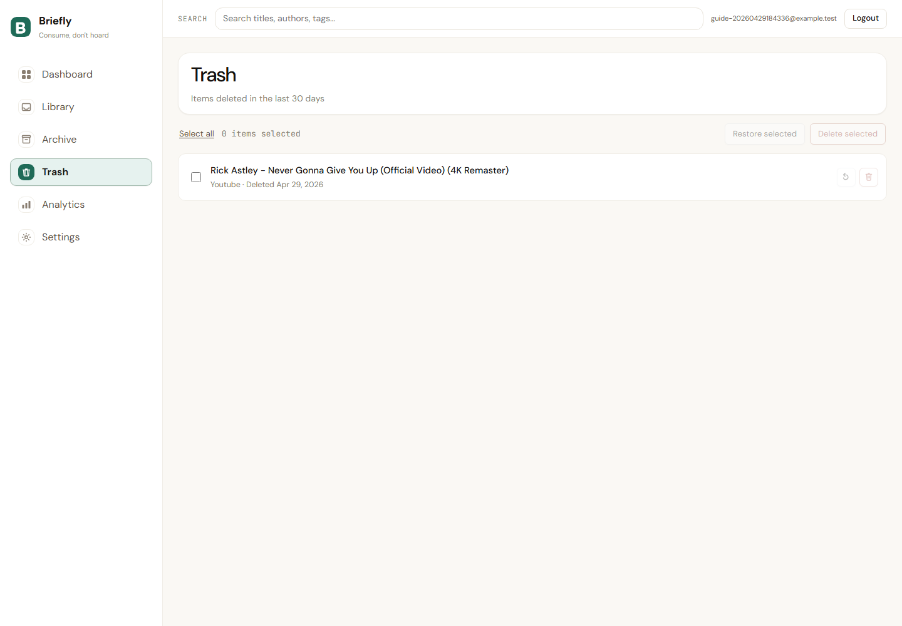

Trash는 삭제한 콘텐츠를 30일 동안 보관하는 화면입니다.

- `Select all`: 현재 Trash 목록의 모든 항목을 선택합니다.
- 체크박스: 개별 항목을 선택합니다.
- `Restore selected`: 선택한 항목을 Library inbox로 되돌립니다.
- `Delete selected`: 선택한 항목을 영구 삭제합니다.
- 되돌리기 아이콘: 해당 항목 하나만 복구합니다.
- trash 아이콘: 해당 항목 하나를 영구 삭제합니다.

영구 삭제는 되돌릴 수 없으므로 실제 데이터에서 사용할 때는 확인 창을 주의해서 읽어야 합니다.

## 9. Analytics

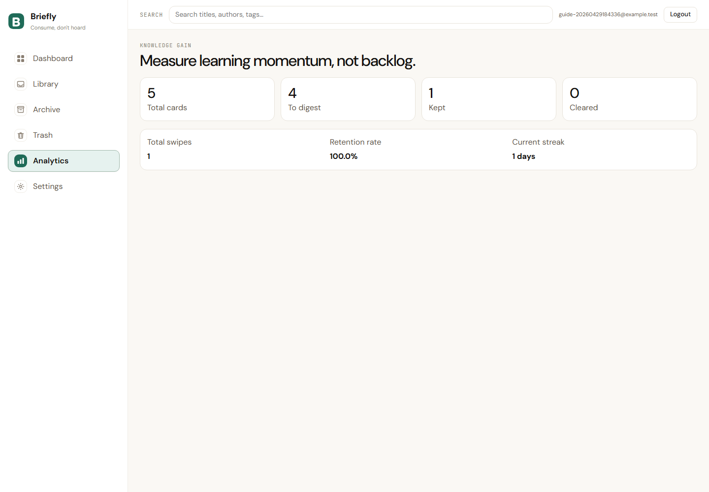

Analytics는 저장한 콘텐츠를 얼마나 처리했는지 보여주는 요약 화면입니다.

- `Total cards`: Library에 있는 전체 콘텐츠 수입니다.
- `To digest`: 아직 처리해야 할 inbox 콘텐츠 수입니다.
- `Kept`: Archive로 보낸 콘텐츠 수입니다.
- `Cleared`: 삭제 처리된 콘텐츠 수입니다.
- `Total swipes`: Keep/Discard 같은 처리 액션 수입니다.
- `Retention rate`: 처리한 항목 중 Keep 비율입니다.
- `Current streak`: 연속 사용 또는 처리 흐름을 나타내는 streak 값입니다.

## 10. Settings

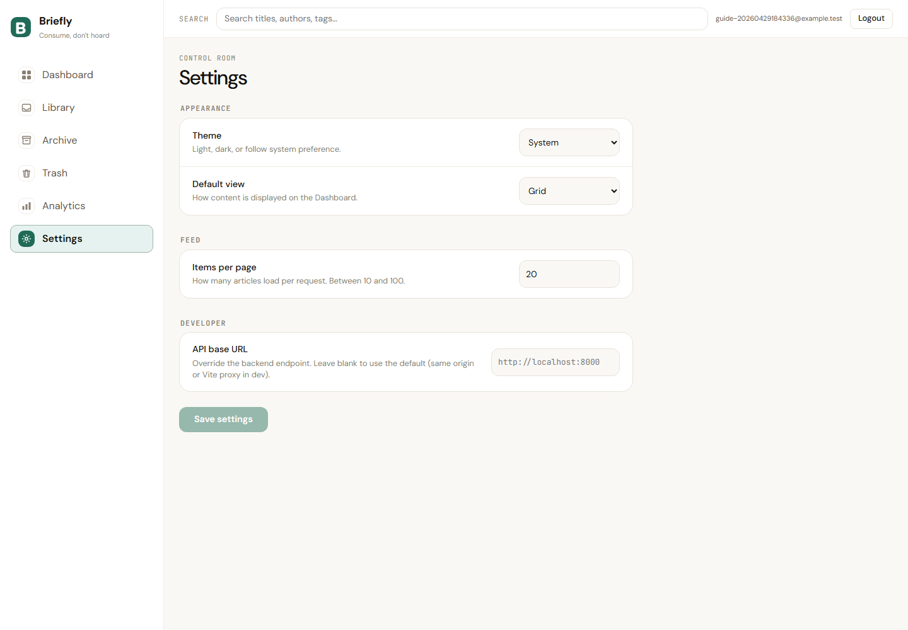

Settings는 dashboard 사용 방식을 바꾸는 화면입니다.

- `Theme`: `Light`, `Dark`, `System` 중 화면 테마를 선택합니다.
- `Default view`: Dashboard의 기본 표시 방식을 `Grid` 또는 `List`로 선택합니다.
- `Items per page`: 한 번에 불러올 콘텐츠 수입니다. 현재 설명상 10에서 100 사이를 권장합니다.
- `API base URL`: dashboard가 호출할 backend endpoint입니다.
  - 로컬 Vite proxy를 쓰면 비워둘 수 있습니다.
  - 명시적으로 backend를 가리키려면 `http://localhost:8000` 또는 `http://127.0.0.1:8000`을 입력합니다.
- `Save settings`: 변경한 설정을 브라우저 localStorage에 저장합니다.

## LLM endpoint 설정 위치

LLM 서버 주소는 dashboard Settings의 `API base URL`에 넣는 값이 아닙니다. Dashboard는 Briefly API만 호출하고, Briefly API가 내부적으로 LLM 서버를 호출합니다.

로컬 llama-server를 사용할 때 backend 프로세스 환경변수는 다음처럼 설정합니다.

```bash
SUMMARY_PROVIDER=openai
SUMMARY_BASE_URL=http://127.0.0.1:8080/v1/chat/completions
SUMMARY_MODEL=local-model
SUMMARY_API_KEY=local-test
```

Windows PowerShell에서는 다음처럼 같은 값을 설정할 수 있습니다.

```powershell
$env:SUMMARY_PROVIDER="openai"
$env:SUMMARY_BASE_URL="http://127.0.0.1:8080/v1/chat/completions"
$env:SUMMARY_MODEL="local-model"
$env:SUMMARY_API_KEY="local-test"
```

핵심은 포트입니다.

- `8000`: Briefly API
- `3001`: Dashboard
- `8025`: Mail catcher UI
- `8080`: llama-server LLM endpoint

## Playwright 캡처 재현

이번 가이드의 이미지는 Playwright로 실제 로컬 서버에 접속해 생성했습니다.

1. llama-server가 `http://127.0.0.1:8080`에서 떠 있어야 합니다.
2. Briefly API, dashboard, mail catcher가 각각 `8000`, `3001`, `8025`에서 떠 있어야 합니다.
3. `web-dashboard`에서 Chromium이 설치되어 있어야 합니다.

```bash
cd web-dashboard
npx playwright install chromium
```

그 뒤 Playwright 스크립트나 테스트에서 `http://127.0.0.1:3001`을 열어 화면을 캡처하면 됩니다.

