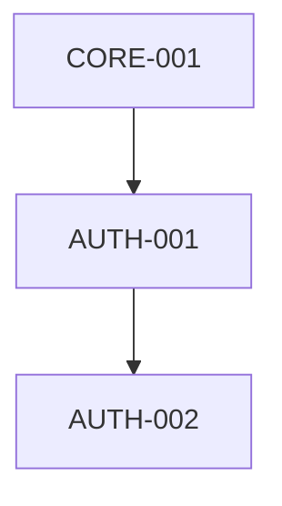

# Dependency Matrix & Graph

> 목적: 개별 spec에 흩어진 의존성 선언을 하나의 통합 매트릭스로 합성하고 검증한다.

## Dependency Matrix

> 행(row) 기능이 열(column) 기능에 의존하면 X 표시.

|  | CORE-001 | CORE-002 | AUTH-001 | AUTH-002 | ... |
|---|---|---|---|---|---|
| CORE-001 | - | | | | |
| CORE-002 | | - | | | |
| AUTH-001 | X | | - | | |
| AUTH-002 | | | X | - | |

## Binary Dependency Test

매트릭스의 모든 X 표시에 대해 다음 질문을 적용:

> "행 기능이 열 기능의 **구체적인 출력, 설정, 또는 기능**을 동작에 필요로 하는가?"

- **Yes** → 진짜 의존성. 유지.
- **No** → 제거. (단순 조율, 도구 공유, 편의상 순서는 의존성이 아님)

## Dependency Graph

> Mermaid 또는 Graphviz로 생성. 순환 참조는 폐쇄 루프로 즉시 식별 가능.

## Cycle Resolution (순환 참조 해결 — 4단계)

순환 발견 시 순서대로 시도:

1. **Dependency Elimination**: Binary test를 재적용. 진짜 기술적 의존인지 재검토.
2. **Revised Specification**: 인터페이스를 재설계하여 서로의 출력이 필요 없도록 계약 변경.
3. **Feature Splitting**: 기능이 원자적이지 않을 수 있음. 더 작은 단위로 분할.
4. **Consolidation (최후 수단)**: 두 기능을 하나로 병합. 복잡해지므로 가능한 피할 것.

각 해결 후: 매트릭스 업데이트 → 그래프 재생성 → 순환 재검사. 순환 0이 될 때까지 반복.

## Implementation Layers (자동 도출)

- **Layer 0 (Phase 1)**: 의존성 없는 기능들
- **Layer 1 (Phase 2)**: Layer 0에만 의존하는 기능들
- **Layer N (Phase N+1)**: Layer N-1 이하에만 의존하는 기능들
- 같은 Layer 내의 기능은 서로 의존하지 않아야 함
